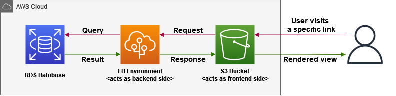

# Infrastructure Description

This is a website running with the following specifications:

<table>
    <tr>
        <th>Category</th>
        <th>Used Technology</th>
        <th>Version</th>
    </tr>
    <tr>
        <td>Front-End</td>
        <td>Angular</td>
        <td>8</td>
    </tr>
    <tr>
        <td>Back-End</td>
        <td>NodeJS</td>
        <td>14.15.1</td>
    </tr>
    <tr>
        <td>Database</td>
        <td>PostgreSQL</td>
        <td>-</td>
    </tr>
    <!-- AWS -->
    <tr>
        <td rowspan=4>Cloud Hosting</td>
    </tr>
    <tr>
        <td>AWS RDS</td>
        <td>-</td>
    </tr>
    <tr>
        <td>AWS EB</td>
        <td>-</td>
    </tr>
    <tr>
        <td>AWS S3</td>
        <td>-</td>
    </tr>
    <tr>
        <td>CI/CD</td>
        <td>CircleCI</td>
        <td>-</td>
</table>

## Workflow

In this section, you will find simple explanation for the used infrastructure full cycle.

### Steps

1. The user enters a specific URL into browser.
2. Website communicates with specific server API.
3. Server sends a query for the required data to the database.
4. Database sends the requested data back to the server.
5. Server responds with the desired data back to the website as JSON response.
6. Website renders the retrieved data on user's screen.

### Diagram

