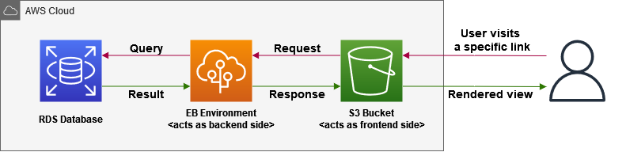
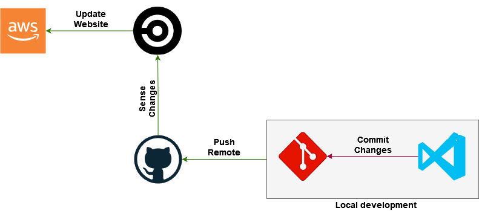

# Review Screenshots

- AWS Screenshots

  - [`AWS Infrastructure Overview` Screenshot](Overview/aws-loop.png)
    

  - [`AWS EB` Screenshots](AWS-EB/)
    
    

  - [`AWS RDS` Screenshots](AWS-RDS/)
    
    

  - [`AWS S3` Screenshots](AWS-S3/)
    
    

- CircleCI Screenshots

  - [`CircleCI Pipeline Overview` Screenshot](Overview/circleci-loop.png)
    

  - [`CircleCI Build` Screenshots](CircleCI-Build/):
    - Workflow
      
    - `udagram-frontend/` sub-workflow:
      - Installation
        
      - Build
        
      - Deploy
        
    - `udagram-api/` sub-workflow:
      - Installation
          
      - Build
          
      - Deploy
          

  - [`CircleCI Environment Variables` Screenshots](CircleCI-Environment/)
    
    
